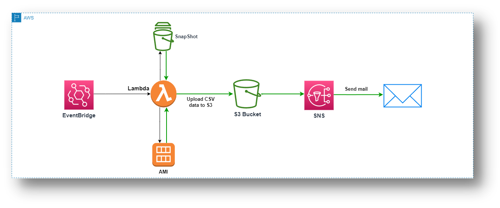

# AWS AMI and Snapshot Management Architecture

## Overview

This architecture is designed to automate the management of Amazon Machine Images (AMIs) and snapshots in an AWS environment. By deploying the provided AWS CloudFormation stack, teams can efficiently monitor and maintain their AMIs and snapshots. The scheduled Lambda function retrieves data from all AWS regions, identifies outdated resources, and generates notifications through Amazon Simple Notification Service (SNS). This automation reduces manual effort and enhances overall resource management.

## Architecture Diagram

## Key Features

- **Automation**: This CloudFormation (CFN) template sets up an automated resource management system.
- **Event Trigger**: It configures an EventBridge rule to trigger a Lambda function at predefined intervals.
- **Data Retrieval**: The Lambda function concurrently retrieves details of AMIs and snapshots from all AWS regions.
- **Resource Identification**: It identifies outdated resources among the retrieved data.
- **Data Upload**: The Lambda function uploads the outdated resource information in CSV format to an S3 bucket.
- **Notification**: Additionally, it sends notifications through SNS to inform stakeholders about resource status changes.
- **Simplified Management**: This template simplifies and enhances resource management in your AWS environment.
- **Proactive Approach**: It offers a proactive and efficient approach to resource monitoring and maintenance.

## Scheduled Automation

The Lambda function runs on a weekly basis as defined by the ScheduleExpression parameter. It sends notifications via SNS, providing insights into the number of existing AMIs and snapshots. This proactive monitoring ensures clear visibility into backup status and helps promptly identify outdated resources that require attention.

## Deployment

To deploy this architecture, use the following AWS CloudFormation template: [OldAMISnapshotDetection.yaml](https://hariom-cfn-code.s3.ap-south-1.amazonaws.com/old-ami-snapshot/OldAMISnapshotDetection.yaml)

## CloudFormation Template

The provided CloudFormation template creates the following components:

- An S3 bucket for storing old AMI snapshots.
- An SNS topic for sending notifications.
- An IAM role for the Lambda function with necessary permissions.
- A Lambda function to handle AMI snapshot scheduling.
- An EventBridge rule to trigger the Lambda function on a schedule.
- An EventBridge permission to allow the rule to invoke the Lambda function.

## Lambda Function Responsibilities

The Lambda function is responsible for the following tasks:

1. **Describe all of the AMIs in the account.**  
   The function retrieves information about all Amazon Machine Images (AMIs) available within the AWS account.

2. **Identify all of the AMIs that are older than a certain number of days.**  
   It identifies AMIs that have exceeded a defined age threshold, typically older than a specific number of days.

3. **Upload the details of old AMIs and snapshots to the S3 bucket.**  
   The details of old AMIs and snapshots in CSV format are securely stored in an Amazon S3 bucket designated for this purpose.

4. **Send a notification to the SNS topic about the old AMI snapshots.**  
   The Lambda function publishes notifications to the specified Simple Notification Service (SNS) topic, providing details about the created snapshots.

The Lambda function operates on a schedule defined by the EventBridge rule. For instance, you can configure the Lambda function to execute weekly, ensuring consistent management and maintenance of AMIs and snapshots.

Ensure that you update the environment variables in the Lambda function according to your requirements.

For detailed instructions and deployment, refer to the [official documentation](https://docs.aws.amazon.com/lambda/latest/dg/welcome.html).

**Note:** It's important to understand your AWS environment and specific requirements before deploying this architecture to ensure it meets your needs effectively.

## Contributing

If you'd like to contribute to this project or have suggestions for improvements, please feel free to submit a pull request or open an issue on the GitHub repository.

## License

This project is licensed under the MIT License. This means that you are free to use, modify, and distribute the code for any purpose, including commercial use. See the [LICENSE](LICENSE) file for details.

Made with love by Hari Om❤️.
